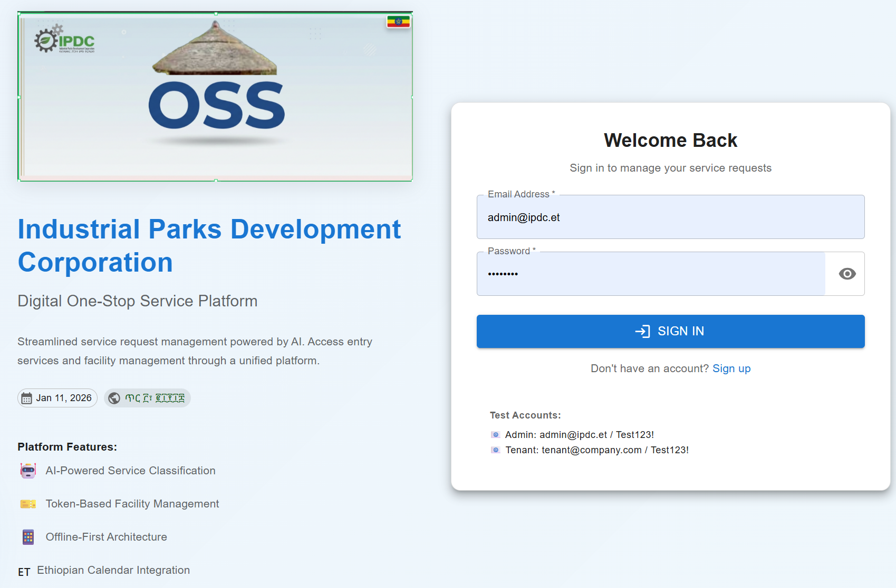
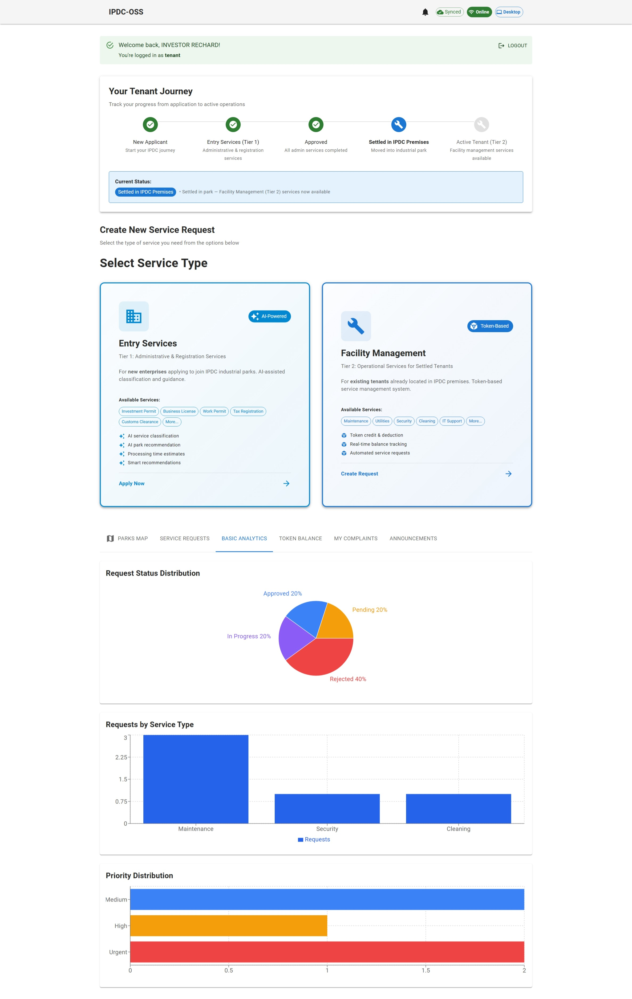
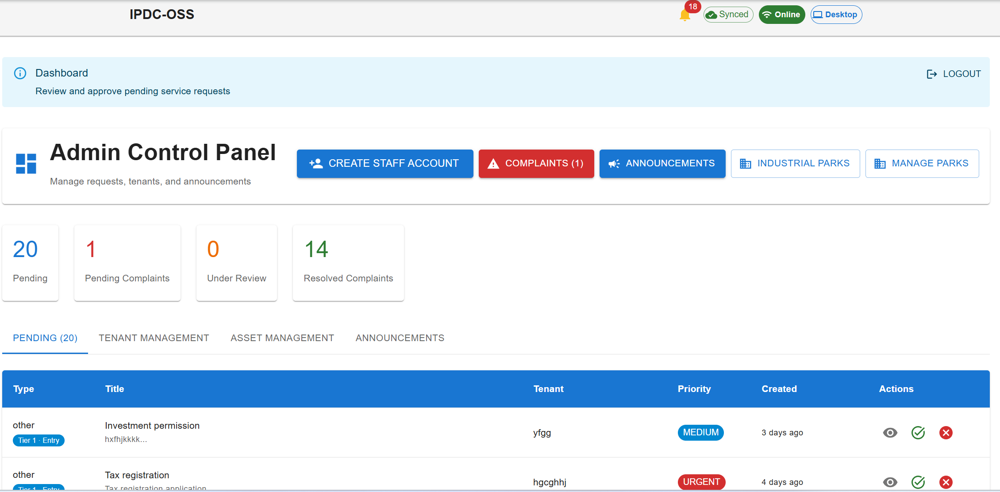
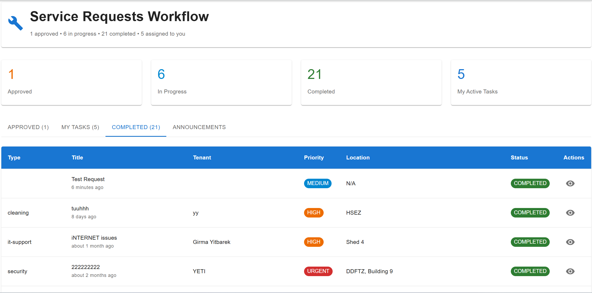
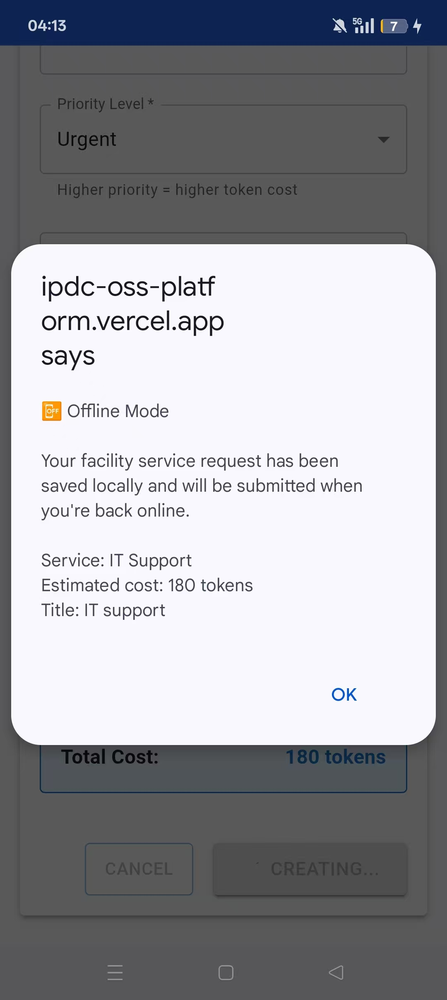
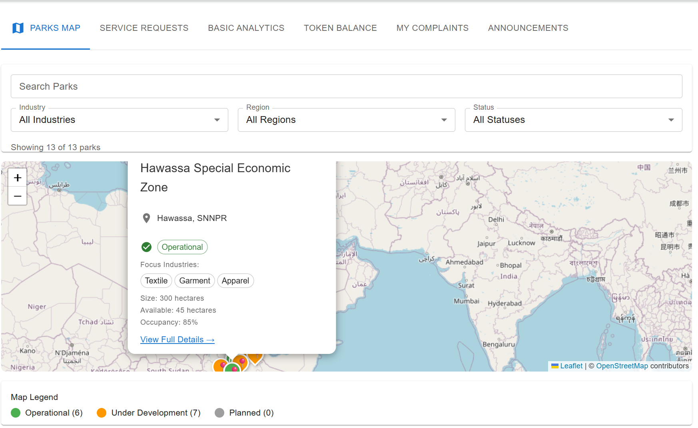
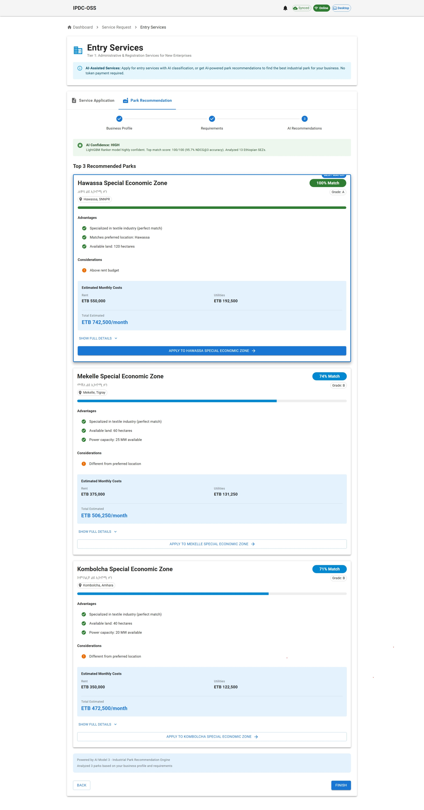
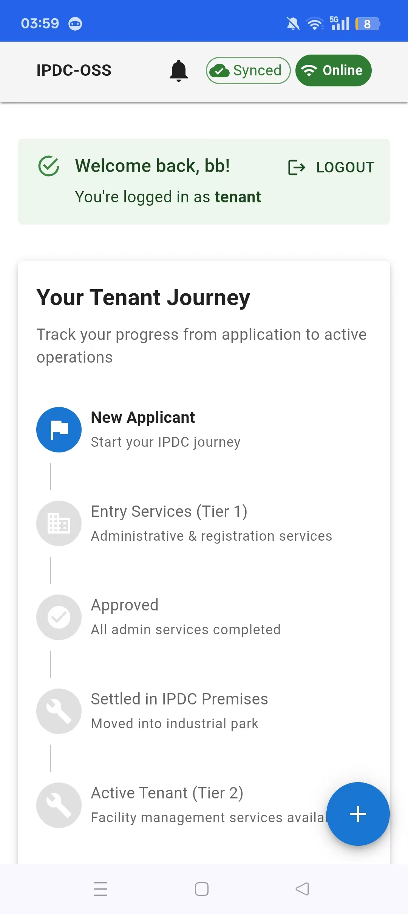
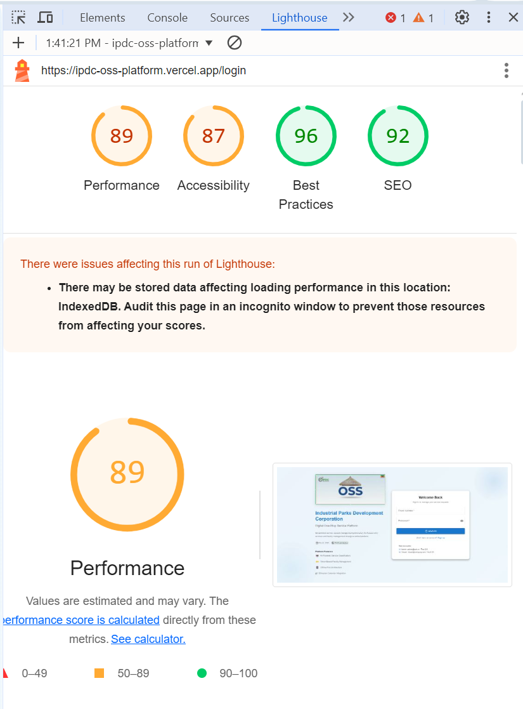

# IPDC Digital One-Stop Service Platform

**Bridging the Digital Divide: An Offline-First Digital One-Stop Service Localized from China's Smart Park Model for Ethiopia's Industrial Parks**

An offline-first Progressive Web Application (PWA) for the Ethiopian Industrial Parks Development Corporation (IPDC), enabling reliable digital service delivery across connectivity-constrained industrial parks.

---

## Project Information

| | |
|---|---|
| **Thesis Title** | Bridging the Digital Divide: An Offline-First Digital One-Stop Service Localized from China's Smart Park Model for Ethiopia's Industrial Parks |
| **Author** [Anonymous]
| **Program** | MSc Software Engineering, Nankai University, China |

---

## Abstract

IPDC — Ethiopia's Industrial Parks Development Corporation — runs several parks where service requests still travel on paper. Tenants visit offices in person, fees are collected manually, and stalled requests offer no way to track progress. Chinese smart park platforms like WeChat Work and DingTalk have addressed this problem effectively, but those platforms assume reliable broadband. Ethiopian parks lose internet for three to five hours on a typical day, meaning a direct import of the Chinese solution would trade one failure mode for another.

This thesis designed, built, and evaluated an offline-first digital one-stop service for IPDC, delivered as a Progressive Web Application, using Design Science Research. The resulting prototype supports offline service request submission with automatic synchronization on reconnection, serves three stakeholder roles (management, tenants, operations staff), and integrates three proof-of-concept machine learning models for service classification, predictive maintenance, and park recommendation.

**Keywords:** Offline-First Architecture, Progressive Web Application, Digital One-Stop Service, Smart Industrial Park, Design Science Research, Technology Adaptation, Ethiopian Industrial Parks

---

## Research Questions

**RQ1:** What systematic adaptation methodology enables the transfer of Chinese Smart Park digital governance models to connectivity-constrained African industrial parks?

**RQ2:** How should offline-first PWA architecture be designed to maintain functional parity with online systems for complex industrial park service workflows?

**RQ3:** What design principles should guide feature prioritization for offline availability in multi-stakeholder industrial platforms?

---

## Live Deployment

| Service | URL |
|---------|-----|
| **Frontend (PWA)** | https://ipdc-oss-platform.vercel.app/ |
| **AI Backend API** | https://ipdc-oss-platform.onrender.com/api/docs |

---

## Evaluation Results

| Metric | Result |
|--------|--------|
| **SUS Score** | 86.5 / 100 (above 68 baseline) |
| **Participants** | 12 IPDC stakeholders |
| **Min. Individual Score** | 80.0 |
| **Offline scenarios tested** | 9 (under simulated conditions) |
| **First Load Time** | < 3 seconds |
| **Cached Load Time** | < 1.5 seconds |
| **Offline Response Time** | < 500 ms |

---

## Screenshots

**Sign-In Page**


**Tenant Dashboard — service requests, token balance, and announcements**


**Admin Dashboard — tenant management, request processing, and park operations**


**Operations Dashboard — maintenance tasks and work orders**


**Offline Submission — service request submitted while offline, queued for synchronization**


**Interactive Map — all 13 Ethiopian Special Economic Zones**


**AI Park Recommendation — ranked SEZ suggestions based on business profile**


**Mobile View — responsive layout on a mobile device**


**PWA Lighthouse Audit Scores**


> See [screenshots/](screenshots/) for the full gallery including all dashboards, AI model performance charts, PWA installation evidence, and offline testing screenshots.

---

## Features

### Core Platform
- **Offline-First Architecture** — core workflows function without internet; data syncs automatically on reconnection
- **Progressive Web App (PWA)** — installable on desktop and mobile from a single codebase
- **Multi-Role Support** — separate interfaces for Tenants, Administrators, and Operations staff
- **Service Request Management** — submit, track, and process requests offline with background sync
- **Digital Token System** — internal credit system for service fee tracking and transaction history
- **Complaint Management** — structured complaint submission and resolution workflow
- **Announcements** — park-wide and targeted announcements with offline delivery
- **Interactive Park Map** — visualize all 13 Ethiopian SEZs with park profiles

### Offline Capabilities
- Authentication with offline fallback (cached credentials after first online sign-in)
- Service request submission queued locally in IndexedDB, replayed on reconnect
- Dashboard access served from Firestore's persistent local cache
- Service worker caches the application shell for offline browsing
- Online/offline status indicators with sync queue monitoring

### AI Models
- **Service Classifier** — automatically categorizes incoming service requests
- **Predictive Maintenance** — predicts asset failure risk and days-to-failure
- **Park Recommendation** — recommends the most suitable SEZ based on business profile

---

## Tech Stack

### Frontend
| Technology | Purpose |
|-----------|---------|
| React 19 | UI framework |
| TypeScript | Type safety |
| Material-UI (MUI) | Component library |
| Vite | Build tool with manual chunk splitting |
| React Router | Client-side navigation |

### Backend & Database
| Technology | Purpose |
|-----------|---------|
| Firebase Firestore | Cloud database with built-in offline persistence |
| Firebase Auth | Authentication with offline credential caching |
| Firebase Hosting / Vercel | Frontend deployment |
| Dexie.js (IndexedDB) | Explicit offline write queue and local storage |

### PWA & Offline
| Technology | Purpose |
|-----------|---------|
| Service Worker | Request interception, asset caching, background sync |
| Workbox | CacheFirst / NetworkFirst / StaleWhileRevalidate strategies |
| vite-plugin-pwa | Automatic service worker and manifest generation |
| IndexedDB (Dexie.js) | Local offline data store and sync queue |

### AI Backend
| Technology | Purpose |
|-----------|---------|
| Python / FastAPI | REST API server for ML model inference |
| scikit-learn | Model training (Random Forest, etc.) |
| Render | Cloud deployment of AI backend |

---

## Project Structure

```
ipdc-platform/
├── src/
│   ├── components/
│   │   ├── admin/          # Admin UI components (6 files)
│   │   ├── common/         # Shared components — StatusBar, FileUpload, etc. (12 files)
│   │   ├── layout/         # Navigation and layout scaffolding (3 files)
│   │   ├── map/            # Interactive park map (3 files)
│   │   ├── operations/     # Operations module components (4 files)
│   │   └── tenant/         # Tenant-specific components (13 files)
│   ├── pages/              # Page-level route components (15 files)
│   ├── services/           # Business logic and API services (18 files)
│   │   └── offline/        # Offline storage and sync services (3 files)
│   ├── contexts/           # React context providers (AuthContext)
│   ├── hooks/              # Custom React hooks (4 files)
│   ├── db/                 # Dexie.js schema definition
│   ├── types/              # TypeScript type definitions (8 files)
│   └── config/             # Firebase and theme configuration
├── ai-models/              # Three ML models + FastAPI backend (12 files)
│   └── data/raw/           # Synthetic training datasets (CSV)
├── data/research/          # SUS evaluation workbook and questionnaire responses
├── screenshots/            # 31 thesis figures and platform screenshots
├── public/                 # Static assets and PWA manifest
├── .env.example            # Environment variables template
├── vite.config.ts          # Vite + PWA configuration
└── package.json            # Dependencies
```

---

## Getting Started

### Prerequisites
- Node.js 20+ and npm 10+
- Git
- Firebase account (for backend)
- Python 3.11+ (for AI backend only)

### Frontend Setup

1. **Clone the repository**
```bash
git clone https://github.com/yeti2014/IPDC-OSS-platform.git
cd IPDC-OSS-platform
```

2. **Install dependencies**
```bash
npm install
```

3. **Configure Firebase**
```bash
cp .env.example .env
# Edit .env with your Firebase project credentials
```

4. **Run development server**
```bash
npm run dev
# Open http://localhost:5173
```

5. **Build for production**
```bash
npm run build
```

### AI Backend Setup (optional)

```bash
cd ai-models
pip install -r requirements.txt
python main.py
# API available at http://localhost:8000/api/docs
```

### Available Scripts

| Script | Description |
|--------|-------------|
| `npm run dev` | Start development server with HMR |
| `npm run build` | Build for production |
| `npm run preview` | Preview production build locally |
| `npm run lint` | Run ESLint |

---

## Research Outputs

This thesis produced four principal outputs:

1. **China-to-Ethiopia Technology Adaptation Framework** — a four-dimension (infrastructure, functional, cultural, operational) framework for adapting smart park governance models across connectivity contexts
2. **Offline-First Architecture for Industrial PWAs** — dual-layer storage combining Firestore transparent persistence with an explicit Dexie.js write queue
3. **Seven Design Principles for Offline-First Computing** — empirically derived principles for feature prioritization and architecture decisions under variable connectivity
4. **IPDC Digital One-Stop Service Platform** — a PWA prototype addressing offline-first digital service delivery for Ethiopian industrial parks

---

## Evaluation Data

The `data/research/` directory contains:
- `SUS_Evaluation_IPDC_OSS.xlsx` — SUS questionnaire responses from 12 IPDC stakeholders (March 2026), including raw scores, per-item analysis, and charts
- `IPDC_OSS_Questionnaire_Responses.xlsx` — requirements-gathering questionnaire responses from representatives across 11 IPDC parks and SEZs

---

## License

Copyright (c) 2026[Anonymous]. All Rights Reserved.

This project is made publicly visible for academic review and portfolio purposes only.
Unauthorized copying, redistribution, or commercial use is strictly prohibited.
See the [LICENSE](LICENSE) file for full details.

---

## Contact

**Author:** [Anonymous]
**Institution:** Nankai University, College of Software, China
**Program:** MSc Software Engineering
